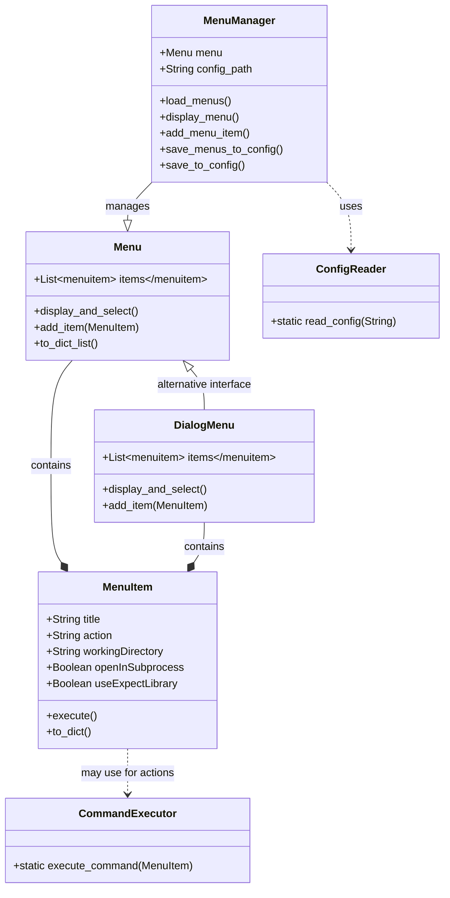
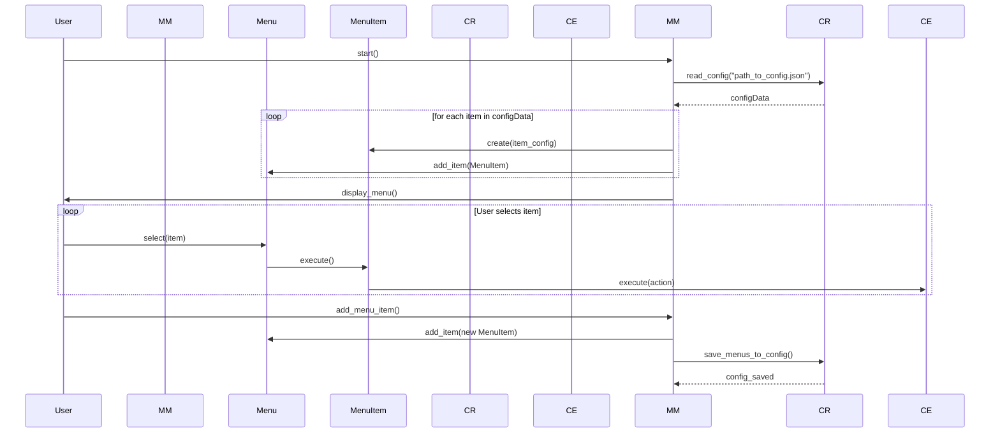

# CLAUDE.md

This file provides guidance to Claude Code (claude.ai/code) when working with code in this repository.

## Project Overview

This is a Python-based smart menu system designed for managing and executing commands through a configurable terminal interface. The system provides an interactive menu that can load command configurations from JSON files and execute system commands with various options. It supports both console-based and dialog-based (using Python's dialog library) menu interfaces.

## Architecture

### Core Components

1. **Menu System**:
   - `Menu.py` - Main menu display and user interaction handler with console interface
   - `DialogMenu.py` - Dialog-based menu interface using Python dialog library
   - `MenuManager.py` - Loads menu configurations and manages menu lifecycle
   - `MenuItem.py` - Individual menu item representation with command execution
   - `SmartMenuItem.py` - Enhanced menu item with additional features

2. **Configuration Management**:
   - `ConfigReader.py` - JSON configuration file reader with error handling
   - `menu_configurations/` - Directory containing JSON configuration files
   - `config.json` - Default configuration file
   - `diet_pi.json` - DietPi-specific configuration for pickleball/tennis game controls
   - `tennis_game_config.json` - Tennis game specific configuration

3. **Command Execution**:
   - `CommandExecutor.py` - Handles command execution with directory management
   - Support for subprocess execution and working directory changes
   - Error handling for command execution failures

4. **Entry Points**:
   - `smart_menu_system.py` - Main entry point for the smart menu system
   - `test_smart_menu_system.py` - Test entry point with different default config

## Class Diagram



## Sequence Diagram



## Common Commands

### Running the Smart Menu System

```bash
# Run with default configuration
python3 smart_menu_system.py

# Run with specific configuration file
python3 smart_menu_system.py ./menu_configurations/diet_pi.json

# Run test version
python3 test_smart_menu_system.py
```

### Configuration Files

The system uses JSON configuration files in the following format:

```json
[
    {
        "title": "Menu Item Title",
        "action": "command to execute",
        "working_directory": "/path/to/working/directory",
        "open_in_subprocess": false,
        "use_expect_library": false
    }
]
```

## Key Features

### Menu Item Configuration

Each menu item supports:
- **title**: Display name in the menu
- **action**: Shell command to execute
- **working_directory**: Directory to change to before execution (optional)
- **open_in_subprocess**: Whether to run in a separate subprocess
- **use_expect_library**: Support for expect library (placeholder for future implementation)

### Command Execution

The system handles:
- Directory changes before command execution
- Subprocess execution for background tasks
- Error handling with try/catch blocks
- Automatic directory restoration after execution

### Dialog Interface Support

The system includes support for dialog-based menus using Python's dialog library:
- `DialogMenu.py` provides an alternative interface to the console-based menu
- Uses dialog boxes for menu selection instead of console input/output
- Maintains the same functionality as the console interface

### DietPi Integration

The `diet_pi.json` configuration includes specialized commands for:
- Pickleball game control (start/stop/test scenarios)
- Tennis game control
- System brightness adjustment
- System restart functionality
- Git repository updates
- Test input file management

## Usage Patterns

### Adding New Menu Items

1. Edit the appropriate JSON configuration file
2. Add new menu item with required fields
3. Restart the menu system to load changes

### Creating New Configurations

1. Create new JSON file in `menu_configurations/`
2. Follow the standard menu item format
3. Run with: `python3 smart_menu_system.py ./menu_configurations/your_config.json`

### Background Process Management

For long-running commands, use:
```json
{
    "title": "Background Task",
    "action": "nohup your_command > /dev/null 2>&1 &",
    "working_directory": "",
    "open_in_subprocess": false
}
```

### Test Input Management

The system includes specific functionality for managing test inputs:
- Copy test scenarios to active test input files
- Execute pickleball games with specific test scenarios
- Background process management for game instances

## Dependencies

- Python 3.x
- Standard library modules: `json`, `os`, `subprocess`, `sys`
- Optional: `dialog` library for dialog-based interface
- No external dependencies required for basic functionality

## Development Notes

### Design Patterns

The system demonstrates several Gang of Four design patterns:
- **Command Pattern**: MenuItem encapsulates command execution
- **Strategy Pattern**: Different menu interfaces (console vs dialog)
- **Template Method**: ConfigReader provides template for configuration loading

### Future Enhancements

Based on documentation, planned enhancements include:
- Submenu support for hierarchical menu structures
- Enhanced SmartMenuItem functionality
- Improved expect library integration
- Extended dialog-based interface features

## Integration Context

This smart menu system is designed to work with:
- Raspberry Pi LED matrix projects
- Pickleball/tennis scoring systems
- DietPi operating system
- Game control automation scripts
- System administration tasks

The system provides a user-friendly interface for managing complex command-line operations related to LED matrix games and system administration tasks, with particular focus on sports scoring system management and hardware control.