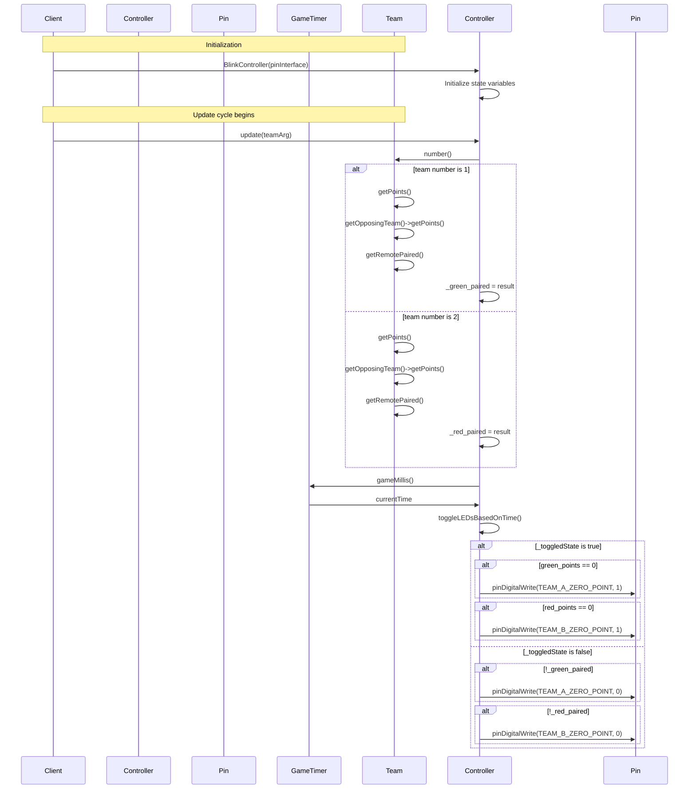

```mermaid
sequenceDiagram
    participant Client
    participant BlinkController as Controller
    participant PinInterface as Pin
    participant GameTimer
    participant Team

    Note over Client, Team: Initialization
    Client->>Controller: BlinkController(pinInterface)
    Controller->>Controller: Initialize state variables

    Note over Client, Team: Update cycle begins
    Client->>Controller: update(teamArg)
    Controller->>Team: number()
    alt team number is 1
        Team->>Team: getPoints()
        Team->>Team: getOpposingTeam()->getPoints()
        Team->>Team: getRemotePaired()
        Controller->>Controller: _green_paired = result
    else team number is 2
        Team->>Team: getPoints()
        Team->>Team: getOpposingTeam()->getPoints()
        Team->>Team: getRemotePaired()
        Controller->>Controller: _red_paired = result
    end

    Controller->>GameTimer: gameMillis()
    GameTimer->>Controller: currentTime
    Controller->>Controller: toggleLEDsBasedOnTime()
    alt _toggledState is true
        alt green_points == 0
            Controller->>Pin: pinDigitalWrite(TEAM_A_ZERO_POINT, 1)
        end
        alt red_points == 0
            Controller->>Pin: pinDigitalWrite(TEAM_B_ZERO_POINT, 1)
        end
    else _toggledState is false
        alt !_green_paired
            Controller->>Pin: pinDigitalWrite(TEAM_A_ZERO_POINT, 0)
        end
        alt !_red_paired
            Controller->>Pin: pinDigitalWrite(TEAM_B_ZERO_POINT, 0)
        end
    end
```
