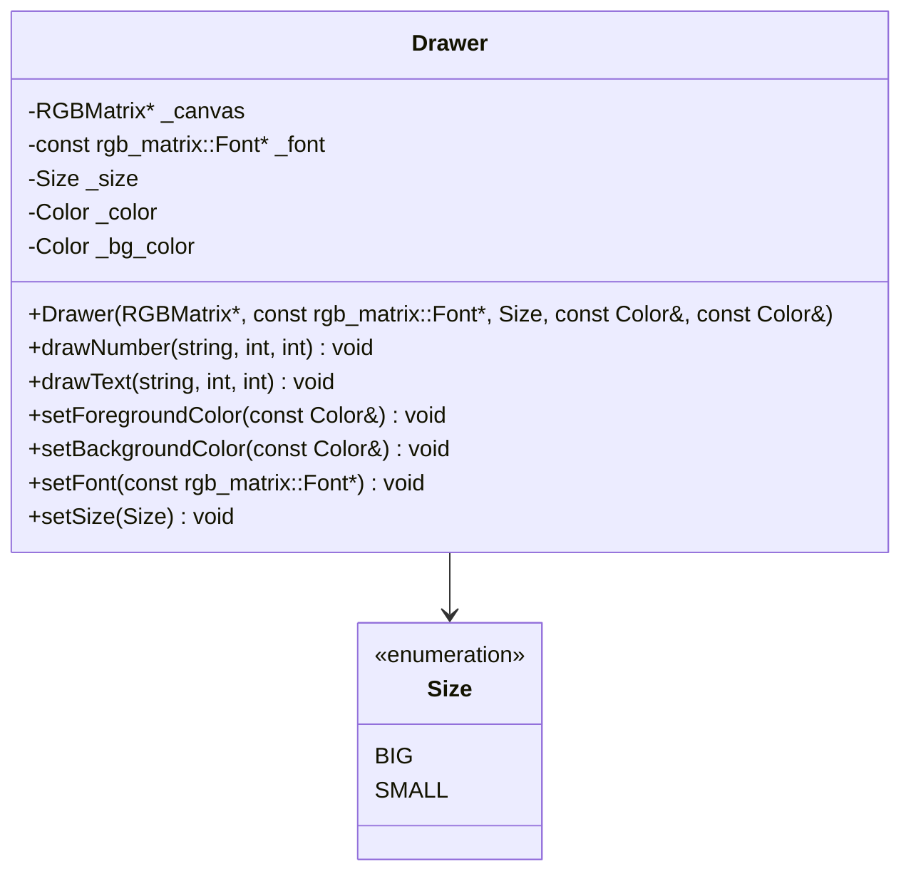
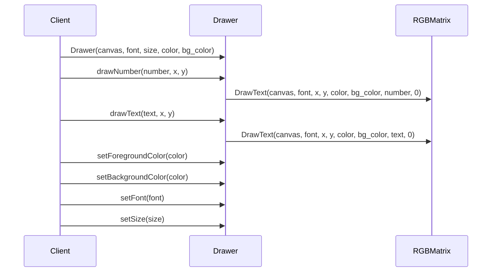

# Class Diagram

```mermaid
classDiagram
    class Drawer {
        -RGBMatrix* _canvas
        -const rgb_matrix::Font* _font
        -Size _size
        -Color _color
        -Color _bg_color
        +Drawer(RGBMatrix*, const rgb_matrix::Font*, Size, const Color&, const Color&)
        +drawNumber(string, int, int) void
        +drawText(string, int, int) void
        +setForegroundColor(const Color&) void
        +setBackgroundColor(const Color&) void
        +setFont(const rgb_matrix::Font*) void
        +setSize(Size) void
    }
    class Size {
        <<enumeration>>
        BIG
        SMALL
    }
    Drawer --> Size
```

# Sequence Diagram

```mermaid
sequenceDiagram
    participant Client
    participant Drawer
    participant RGBMatrix

    Client->>Drawer: Drawer(canvas, font, size, color, bg_color)
    Client->>Drawer: drawNumber(number, x, y)
    Drawer->>RGBMatrix: DrawText(canvas, font, x, y, color, bg_color, number, 0)
    Client->>Drawer: drawText(text, x, y)
    Drawer->>RGBMatrix: DrawText(canvas, font, x, y, color, bg_color, text, 0)
    Client->>Drawer: setForegroundColor(color)
    Client->>Drawer: setBackgroundColor(color)
    Client->>Drawer: setFont(font)
    Client->>Drawer: setSize(size)
```